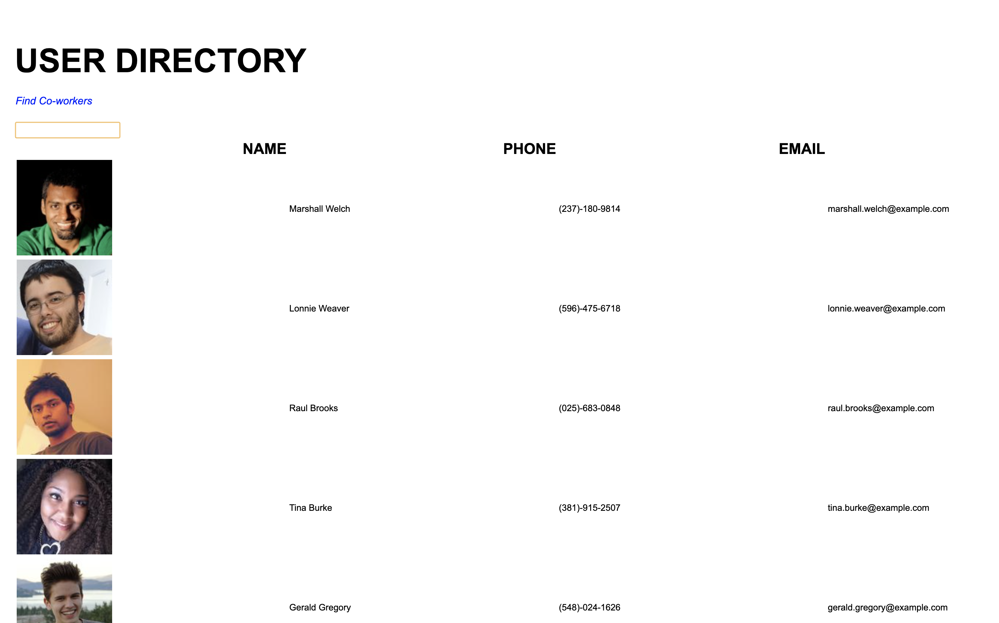

# EMPLOYEE DRIECTORY
Employee Directory is a single-page web application that provides an employer the ability to quickly view an entire network of basic employee contact information.

## Description
The application was built using Model View Control(MVC) design architecture. A MVC design approach divdes the program logic into the three interconnected elements: *Model* for data manipulation, *View* also known as user interface, and *Controller* that works as data dispatcher for the full system design. The application is supported and deployed with React and deployed to Heroku.

## Technology
* [React](https://reactjs.org/docs/design-principles.html)
* [Node.js](https://nodejs.org/en/)
* [npmjs](https://docs.npmjs.com/)
* [Inquirer](https://www.npmjs.com/package/inquirer)
* [HTML](https://developer.mozilla.org/en-US/docs/Web/HTML)
* [CSS](https://developer.mozilla.org/en-US/docs/Web/CSS)

## Authors
### Payton Banks
- [LinkedIn](https://www.linkedin.com/feed/)
- [Github](https://github.com/paytonbanks)
- [Email](mailto:payton.banks@gmail.com)

## Project Site
*link*\
[Employee Directory](https://paytonbanks.github.io/user-directory/)